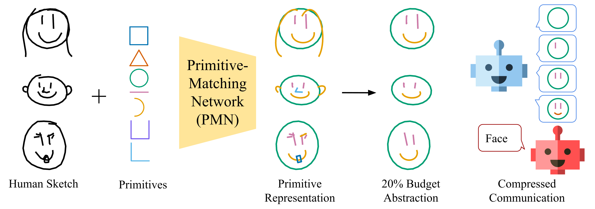

# Abstracting Sketches through Simple Primitives
This is the official PyTorch code for our ECCV 2022 paper on Abstracting Sketches through Simple Primitives. It allows training and testing of our Primitive Matching Network (PMN) on Quickdraw, ShoeV2 and ChairV2 datasets.




## Installation
All Python dependencies can be installed into a conda environment with the provided environment.yml file. To setup the code and environment, run the following commands.

1. Clone the repository
```shell
git clone https://github.com/ExplainableML/sketch-primitives.git
cd rdtc
```
2. Create conda environment
```shell
conda env create -f environment.yml
```
3. Activate environment
```shell
conda activate sketch-primitives
```
4. The script `./download_data.sh` downloads Quickdraw, ShoeV2 and ChairV2 into `./data`


## Usage
The following commands are examples for training the PMN model. To see all possible parameters, use `python main.py --help`. By default, logs are saved into `./log` including model checkpoints and tensorboards. Data is expected to be in `./data` unless otherwise specified.


### Classification on Quickdraw
* Train sketch classifier on the original dataset for evaluation purposes.
```
python main.py --log-name classifier_quickdraw09 --model-type classifier --dataset quickdraw09
```

* Train the PMN model self-supervised to do sketch abstractions with primitives.
```
python main.py --log-name pmn_quickdraw09 --model-type pmn --dataset quickdraw09
```

* Process the dataset with PMN to create a new dataset consisting of primitive reconstructions.
```
python save_processed_images.py --log-name pmn_quickdraw09_processed --model-type pmn --dataset quickdraw09 --test ./log/pmn_quickdraw09/model_best_acc.pt --only-save-coords
```

* Evaluate PMN reconstructions using a communication task with limited budget and the previously trained sketch classifier.
```
python main.py --log-name pmn_communication_quickdraw09 --model-type communication --dataset quickdraw09 --loss-model-type class --loss-model-ckpt ./log/classifier_quickdraw09/model_best_acc.pt --budget 0.3 --test 1 --preprocessed-root ./log/pmn_quickdraw09_processed/data/coords/
```


### Fine-grainded Sketch-based Image retrieval (FG-SBIR) on ShoeV2 and ChairV2
* Create sketch images with our rendering (to avoid distribution shift).
```
python save_processed_images.py --log-name chairv2_processed --model-type none --dataset chairv2
ln -sf $(pwd)/log/chairv2_processed/data/imgs data/chairv2/sketch_picture_files
```

* Train a sketch-based image retrieval model on the original data for use as an evaluation model.
```
python main.py --log-name fgsbir_chairv2 --model-type fgsbir --dataset chairv2 --load-fgsbir-photos
```

* Train the PMN model self-supervised to do sketch abstractions with primitives.
```
python main.py --log-name pmn_chairv2 --model-type pmn --dataset chairv2
```

* Process the dataset with PMN to create a new dataset consisting of primitive reconstructions including sketch images for a specific budget.
```
python save_processed_images.py --log-name pmn_chairv2_processed_budget0.3 --model-type pmn --dataset chairv2 --test ./log/pmn_chairv2/model_best_acc.pt --budget 0.3 --loss-model-type none --add-comm-model --load-fgsbir-photos
```

* Process the dataset with PMN to create a new dataset consisting of primitive reconstructions including sketch images for a specific budget.
```
python save_processed_images.py --log-name pmn_chairv2_processed_budget0.3 --model-type pmn --dataset chairv2 --test ./log/pmn_chairv2/model_best_acc.pt --budget 0.3 --loss-model-type none --add-comm-model --load-fgsbir-photos
ln -sf $(pwd)/log/pmn_chairv2_processed_budget0.3/data/imgs data/chairv2/sketch_picture_files
```

* Evaluate PMN reconstructions on the previously trained FG-SBIR model.
```
python main.py --log-name pmn_communication_chairv2_budget0.3 --model-type fgsbir --dataset chairv2 --load-fgsbir-photos --test log/fgsbir_chairv2/model_best_acc.pt
```


## Citation
If you use this code, please cite
```
@inproceedings{alaniz2022primitives,
  title = {Abstracting Sketches through Simple Primitives},
  author = {Alaniz, S. and Mancini, M. and Dutta, A. and Marcos, D. and Akata, Z.},
  booktitle = {Proceedings of the European Conference on Computer Vision (ECCV)},
  year = {2022}
}
```
